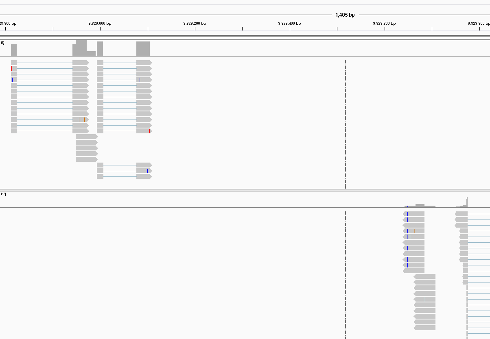

# Separating out forward and reverse strand information

```
samtools view -b -f 16 accepted_hits.bam > reverse_strand.bam
samtools view -b -F 20 accepted_hits.bam > forward_strand.bam
```

## sort and view

```
samtools sort reverse_strand.bam > reverse_strand_sorted.bam
samtools index reverse_strand_sorted.bam
samtools sort forward_strand.bam > forward_strand_sorted.bam
samtools index forward_strand_sorted.bam
```



# Extracting uniquely mapped reads

DISCLAIMER: This works but is slow. At some point I'm going to write something better as this doesn't seem to be a solved problem.

In this context a uniquely mapped read is defined as one which has only mapped once. Since we're working with tophat accepted hits files there are no unmapped reads to filter out.

## Obtain a list of reads which only exist once

```
samtools view accepted_hits.bam | awk '{print $1}' | sort | uniq -c | awk '{if ($1==1) print $0}' > uniq_read.list
```

